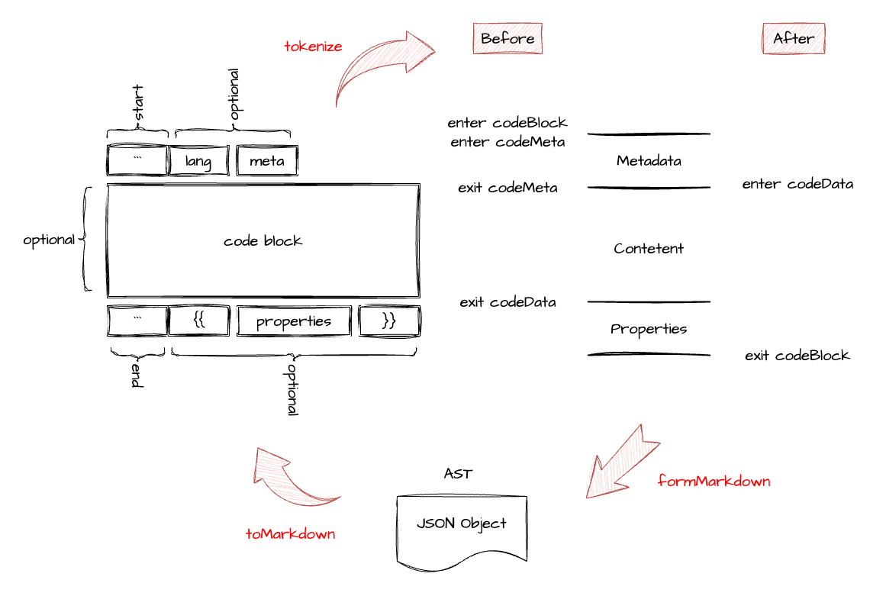

# @imarkjs/remark-code

## Introduction

`@imarkjs/remark-code` is an extension of unifiedjs, to enable code syntax.

Support that parse ast from markdown and compile ast into markdown.

## Features

1. Compatible with standard code syntax.
    <br/>
    \`\`\`lang metadata <br/>
    code <br/>
    \`\`\`<br/>

2. Expending a new feature `props`.
    <br/>
    \`\`\`lang metadata <br/>
    code <br/>
    \`\`\`{{props}} <br/>

## Using

### Install

```bash
npm i unified remark-parse remark-stringify @imarkjs/remark-code -S
```

### Example

```javascript

import {unified} from 'unified'
import remarkParse from 'remark-parse'
import remarkStringify from 'remark-stringify'
import remarkCode from '@imarkjs/remark-code'

const str = `
# Example
\`\`\`lang meta
let s = 'hi'
console.log(s)
\`\`\`{{properties}}
`

const processor1 = unified()
    .use(remarkParse)
    .use(remarkCode)
const ast = processor1.parse(str)
console.log('ast ->', ast)

const processor2 = unified()
    .use(remarkParse)
    .use(remarkCode)
    .use(remarkStringify)
const md = processor2.stringify(ast)
console.log('markdown ->', md)

```

## How does it works ?

